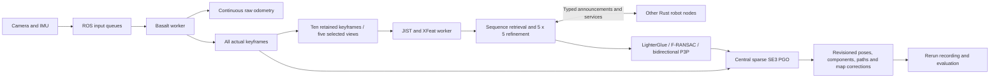

# Native Rust multi-robot visual-inertial SLAM

The `robot` and `backend` executables are **Rust ROS2 nodes using rclrs directly**. They call the existing Basalt, TensorRT, and sparse SE(3) pose-graph crates. There is no new C++ ROS node, wrapper, or application C ABI. Python scripts only publish dataset sensors, launch processes, evaluate results, and visualize them.

The ROS-free algorithm crate is `pipelines/multi-robot`. The existing single-robot loop mode remains available unchanged. DA3, distributed optimization, hybrid tracking, and joint landmark optimization are excluded.



## Build

Validated on Ubuntu 22.04, ROS2 Humble, Rust 1.94 (minimum 1.85 for this ROS workspace), OpenCV 4.5, and TensorRT 10.13.2. Ordinary visloc builds do not require ROS or the ROS Rust toolchain.

`dependencies.lock.json` and `visloc_ros/Cargo.lock` pin the ROS integration. The rclrs release is exactly 0.7.0; rosidl_generator_rs is 0.5.0 at the recorded commit. Its generated `Sequence<T> -> Vec<T>` conversions need the recorded rosidl_runtime_rs 0.6.1 commit, **not runtime 0.7**, whose ABI differs. The separate Cargo workspace prevents these patches from affecting ordinary visloc builds.

Prerequisites: ROS Humble including development headers, libclang 14, OpenCV development libraries, CUDA/TensorRT, `uv`, and Rust. Standard messages must have compatible generated Rust packages (`share/sensor_msgs/rust/Cargo.toml`, etc.) in a sourced ROS overlay. The validated machine already has them in `/opt/ros/humble`. On a fresh Humble installation, first build the standard interfaces according to the [upstream Humble instructions](https://github.com/ros2-rust/ros2_rust#ros-2-humble-hawksbill), using this repository's pinned rosidl generator/runtime. `ros2_cargo_paths.py` verifies this prerequisite and selects generated crates from the sourced overlay.

From the repository root:

```bash
bash scripts/bootstrap_multi_robot_ros2.sh
bash scripts/build_multi_robot_ros2.sh
source scripts/source_multi_robot_ros2.bash
```

Bootstrap installs Python dependencies, the pinned generator, and extracted test_msgs/Clang packages inside ignored `.runtime/` directories. It does not modify `/opt/ros` or require `sudo`. `colcon-cargo` and `colcon-ros-cargo` build/install the Rust nodes. The local `test_msgs` library works around rclrs 0.7's unconditional vendor linkage. The generated `.cargo` patches work around older colcon plugins expecting a `rust_packages` resource index.

Build the existing five-view JIST, XFeat, and XFeat-trained LighterGlue engines on the deployment GPU:

```bash
.runtime/graco-venv/bin/python scripts/build_loop_tensorrt.py \
  --model-dir /path/to/onnx_model --output .runtime/multi_robot_models
```

If the existing GRACO Python environment is absent, create it with `uv venv --python /usr/bin/python3 --system-site-packages .runtime/graco-venv`, then install the validated replay/evaluation dependencies:

```bash
uv pip install --python .runtime/graco-venv/bin/python \
  numpy==2.2.6 scipy==1.15.3 opencv-python-headless==4.14.0.94 \
  rosbags==0.11.5 rerun-sdk==0.37.2 onnxruntime==1.23.2 PyYAML
```

Use Humble's Python 3.10 and source the ROS setup for `rclpy` and generated interfaces. Python is only needed for replay, evaluation, tests, and visualization; the robot/backend executables are Rust.

Required exports are `JIST_r18_512_seqgem_frames.onnx`, `xfeat_320x224.onnx`, and `lg_320x224_dyn.onnx`. Engines use FP32, no TF32, and exactly 128 real matcher features. TensorRT plans are GPU/SDK-specific and are not committed. The bundle manifest records ONNX and engine hashes; every robot saves the effective model configuration and manifest.

## GRACO replay

```bash
source scripts/source_multi_robot_ros2.bash
.runtime/graco-venv/bin/python scripts/prepare_multi_robot_graco.py \
  --output results/graco/my_multi_robot_run --robots 5 6 7 8
.runtime/graco-venv/bin/python scripts/run_multi_robot_mission.py \
  results/graco/my_multi_robot_run/mission.json --domain-id 217
.runtime/graco-venv/bin/python scripts/evaluate_multi_robot.py \
  results/graco/my_multi_robot_run/mission.json
.runtime/graco-venv/bin/python scripts/visualize_multi_robot.py \
  results/graco/my_multi_robot_run/mission.json
```

Replay mission directories must be new. A robot restarted with its existing config creates a new session subdirectory, restores its durable keyframe/loop records and sparse-feature archives, and continues serving earlier sessions. `active_session.json` identifies the current output directory. The keyframe capacity includes archived sessions. Use `--robots 5 7 --max-frames 400` for the two-robot smoke test. Defaults are **left camera only**, f64 Basalt with stationary gyro-only initialization, the existing aerial calibration, 800-pixel width, and 0.75 noise/bias multipliers. Right images and ground truth never enter the estimator. The source bags remain unchanged.

Each first camera timestamp maps to a shared playback epoch; integer camera/IMU intervals remain exact. `mission.json` records every original-to-replay timestamp offset. One `/clock` accompanies playback. The first frame can initialize from the first IMU sample at/after its timestamp; an empty first integration interval is allowed, while later empty intervals are errors. The nominal rate is 0.25x with bounded backpressure, so overload slows replay. Robots receive concurrent batches, with at most one unacknowledged camera frame per robot. The final solve waits for VIO, loop workers, and graph history to drain.

The validation summary reports both nominal and effective playback rate. Add `--profile-replay` to `run_multi_robot_mission.py` to save a standard Python `replay_profile.pstats` file for diagnosing publisher/callback delays; this does not change sensor timestamps or estimator settings.

Set `loop_enabled: false` in a robot JSON config to run the raw-VIO regression control. This bypasses model construction and loop inference without changing sensor preprocessing or Basalt calls.

VIO precision is fixed to f64. The `--scalar-mode` option, ROS `scalar_mode`
configuration field, and core estimator precision selector have been removed.
Remove the old option/field from existing commands/configurations; obsolete
settings are rejected. Previous experiment archives are not modified.

The shared profile validated below 4 m raw ATE RMSE on aerial 5–8 is now the
default when preparing a mission. It
estimates gyro offset from a verified stationary first second and replays all
buffered frames. The 0.75 noise/bias multipliers and 800 px aerial calibration
remain the same. See [full results and limitations](UNIFORM_ATE4_VALIDATION.md).
The separate `stationary-motion` mode also averages gravity and waits for
motion, explicitly counting omitted startup frames; it is not a uniformly
passing profile in either precision mode tested. To explicitly bypass startup,
use `--imu-startup legacy` or `"imu_startup": null` in robot JSON. Missing
startup configuration or `{}` enables the default gyro-only gate;
see [startup behavior and reference methods](../docs/imu-startup.md) and
[the initial f32 experiments](IMU_STARTUP_VALIDATION.md).

Compare completed enabled/control trajectories with `python3 scripts/test_multi_robot_raw_parity.py CONTROL_CSV ENABLED_CSV --frames 400 --output parity.json`. This requires identical frame IDs, timestamps, and every raw pose value; it does not align or rescale trajectories to hide differences.

## Live ROS2

Prepare the same calibration and JSON configuration, set `reliable_sensors: false`, and launch:

```bash
ros2 launch visloc_ros multi_robot.launch.py mission:=/absolute/path/mission.json
```

Or run a single native node with `VISLOC_ROBOT_CONFIG=/path/robot.json ros2 run visloc_ros robot`; the backend uses `VISLOC_BACKEND_CONFIG`. Configure every participating robot in `peers`, use a shared `ROS_DOMAIN_ID`, and configure DDS networking normally across hosts. Only the local replay runner forces `ROS_LOCALHOST_ONLY=1`.

Inputs are `/<robot>/camera/image` (`sensor_msgs/Image`: mono8, rgb8, or bgr8) and `/<robot>/imu` (`sensor_msgs/Imu`). ROS remapping supports existing camera/IMU topic names. Images must use the calibrated raw resolution; preprocessing applies area resizing then radtan undistortion. With `preprocess: null`, supply already rectified pinhole images at the calibrated processing resolution. Inputs must arrive in timestamp order within each sensor topic. Sensor callbacks enqueue only; VIO waits for the IMU watermark to cover each image.

Live inputs use best-effort sensor QoS; replay uses reliable QoS. SLAM records are reliable. Current status, corrected paths, and graph snapshots are transient-local. Communication deadlines use monotonic time; estimation uses message timestamps. Basalt never consumes corrected poses.

## Sequence and verification contracts

- Every actual VIO keyframe enters the odometry graph. For retrieval, skip a keyframe only when more than 95% of its triangulated landmark IDs occur in the last retained keyframe. This runs before feature subsampling; an empty set is retained.
- Each non-overlapping block contains ten retained keyframes. Enumerate all 56 first/last-plus-three selections, minimizing squared consecutive camera-center distances, with lexicographic ties. Missing keyframe ordinals reset incomplete blocks; intentional skips do not.
- Broadcast a normalized 512-dimensional JIST sequence descriptor, selected/member identities, local covisibility neighborhood, and model identity. Cache all five normalized frame descriptors.
- Before scoring, exclude same-session overlapping/adjacent blocks, the 20-second neighborhood, and two-hop covisibility with at least 15 shared landmarks per edge. All sequence members participate. IDs and times never exclude a different robot/session. Keep cosine similarity >=0.8 and up to three distinct neighborhoods.
- Trigger retrieval on local completion and remote announcements/history. Canonical sequence pairs assign one verification owner by robot ID; that robot also serves its archived sessions. Exchange the frame matrix first; maximize the entire 5x5 similarity matrix, then fetch only that pair's sparse packets.
- Sample XFeat at measured VIO feature positions. Fewer than 128 real features produces an empty feature packet and a rejected verification, never padding. Match with the existing trained LighterGlue engine.
- Fundamental-matrix RANSAC precedes both P3P directions and pose refinement. Require at least 15 PnP inliers, a 0.5 ratio among that direction's available 2D–3D correspondences, a 3-pixel RANSAC threshold, mean error <=2.25 px, 2% image-area coverage and four occupied 4x4 cells. Either direction can pass; choose more inliers, then lower reprojection error. Matching attempts are journaled before GPU execution and survive restart. Match a canonical sequence pair once; the old temporal confirmation gate is disabled.
- Landmarks are frozen in their observing camera's metric frame. Every endpoint carries its own intrinsics and camera-to-body extrinsics. No common global alignment is needed for verification.

Composite IDs are `(robot, session, local_id)`; every estimator start generates a new UUID session. Robot-local track IDs are scoped by the enclosing feature packet's robot/session. Typed interfaces are in `visloc_msgs/msg` and `srv`. Sequence, selected-feature, and paginated-history services live under `/<robot>/slam/`. Requests wait at most two seconds per attempt, with up to three retries after the first attempt. Timed-out clients are replaced because rclrs 0.7 otherwise retains unanswered requests after their promises are dropped. Failed requests are logged and deferred for reconnection; no feature matching is repeated after a successfully submitted verification. History cursor changes recover robot restarts.

## Graph conventions and execution

Edges store **T_to_from**, transforming points from the source body to the destination body. Information matrices are row-major, with tangent ordering **translation, then rotation**. Sequential measurements always derive from raw VIO poses. Stable internal solver IDs map composite identities.

The central backend reuses visloc's sparse SE(3) LM with Huber delta 3, 20 iterations, and no more than one solve per second while dirty. Disconnected components solve separately with one anchor each. A verified bridge initializes the joining alignment and removes the redundant anchor. Only finite solutions whose robust objective does not increase are published. Failure retains the last published solution. The graph journal supports restart and peer history recovers its missing tail.

Defaults are odometry 0.15 m / 0.03 rad and loop 0.20 m / 0.04 rad. These are **tuning parameters, not measured covariances**. Configure them in backend `pgo` fields `odometry_translation_sigma`, `odometry_rotation_sigma`, `loop_translation_sigma`, and `loop_rotation_sigma`.

Raw `/<robot>/vio/odometry` and `robot/odom -> robot/base_link` stay continuous. Revisioned `/visloc/graph`, `/<robot>/slam/path`, and `map_<component robot>_<session>_<root keyframe> -> robot/odom` provide corrections. Including the root keyframe distinguishes temporary disconnected fragments within the same session when records arrive out of order.

Queues are bounded: sensor ingress 8192, pending camera images 32, loop worker 4, ROS events 1024, communications 512, graph updates 8192, graph results 2. A full image buffer drops the oldest image and counts it. A full keyframe queue counts a dropped loop keyframe; its ordinal gap resets sequence construction while the odometry keyframe remains in the graph. Sensor ingress overflow reports an error. The configured 4000-keyframe capacity bounds per-robot feature history; exceeding it reports an error rather than silently evicting data needed by a peer.

## Diagnostics, evaluation, and tests

Outputs include raw/corrected trajectories, calibration snapshots and model hashes, effective configs, frozen sequence feature archives, retrieval decisions, selected pairs, geometric outcomes, VIO/encoding/verification timing, queue drops, service failure counts, graph revisions, and component memberships. Exchange-through-verification latency includes descriptor/feature service calls and GPU queueing for a successful attempt, measured with steady time; it excludes earlier failed attempts and retrieval backlog. Replay counts actual serialized topic payload bytes. Each requesting node separately records service calls and typed field payload bytes, explicitly excluding CDR framing/padding and DDS overhead. These are application payload measurements, not total network traffic. `communication.json` also counts sensor-ingress, communication, and backend graph queue overflows; image-buffer and loop-keyframe drops are in robot status.

`evaluate_multi_robot.py` reports metric SE(3) ATE: per-robot raw and corrected results, plus **one rigid alignment for each connected component**, with no scale fitting for reported accuracy. Existing evaluator Sim(3) fields are diagnostic only. Dense corrected poses interpolate graph corrections. Rerun records robot-colored raw/corrected trajectories, selected frame pairs, sparse landmarks, loop edges, and disconnected-component status. Only robots sharing a component appear in a shared map; isolated trajectories retain separate views.

```bash
cargo test -p visloc-multi-robot
cargo test -p visloc-online-loop --features native
source scripts/source_multi_robot_ros2.bash
ROS_DOMAIN_ID=219 ROS_LOCALHOST_ONLY=1 .runtime/graco-venv/bin/python scripts/test_multi_robot_ros2.py
ROS_DOMAIN_ID=220 ROS_LOCALHOST_ONLY=1 .runtime/graco-venv/bin/python scripts/test_multi_robot_robot_ros2.py /path/to/a05.json
ROS_DOMAIN_ID=221 ROS_LOCALHOST_ONLY=1 .runtime/graco-venv/bin/python scripts/test_multi_robot_reconnect_ros2.py /path/to/completed/6_7/mission.json
ROS_DOMAIN_ID=217 .runtime/graco-venv/bin/python scripts/probe_multi_robot_ros2.py /path/to/running/mission.json
cargo build --release -p visloc-tensorrt --features native --example infer_fixtures
.runtime/graco-venv/bin/python scripts/validate_loop_tensorrt.py --bundle .runtime/multi_robot_models
cargo run --release -p visloc-multi-robot --features native --example compare_refinement -- \
  /path/to/completed/mission_directory .runtime/multi_robot_models/loop_config.json
```

The comparison reuses exactly the recorded retrieval pairs and frozen feature packets, rerunning only matching/verification for 5x5 refinement versus fixed-last-frame pairing. It cannot credit different retrieval candidates to refinement. Both variants also write a batch-optimized graph, using identical raw odometry and solver settings; evaluate each with `evaluate_multi_robot.py MISSION --graph refinement/refined_graph.json --output refinement/refined` (and `fixed_last`). These controlled batch results are distinct from the actual online graph. The TensorRT validator reports exact match agreement and separately identifies FP32 membership changes within 1e-5 of the matcher's 0.1 cutoff; all stable matches must agree.

After evaluation, `scripts/summarize_multi_robot.py MISSION` writes `validation_summary.json` with accuracy, connectivity, matching outcomes, latency percentiles, drops, and payload accounting. It checks that all emitted keyframes/loops reached the final graph and each submitted refinement received exactly one verification result. The reconnect test requires a completed archive containing a cross-robot loop; it copies a single pair into a temporary fixture and leaves the original experiment untouched.

Status and communication snapshots use atomic replacement. For legacy runs with interrupted diagnostic writes, `--allow-incomplete-traffic` produces a summary with explicitly unavailable nodes and partial service totals; it never reconstructs missing counters as measurements.

Validation results and known dataset limitations are recorded separately in `VALIDATION.md`. Successful transport or synthetic graph tests do not establish improved dataset accuracy.
